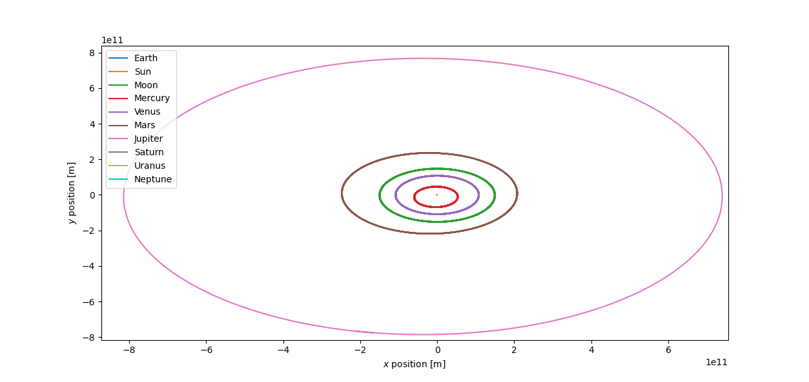

# Python Solar System Simulation

This simulation uses one of the Euler, Euler-Cromer, Euler-Richardson or Verlet methods to simulate and plot the solar system orbits to an accurate degree by pulling position and velocity data from the JPL Horizons ephemerides. The simulation is saved and can be plotted and easily read at a later date.



To run my simulation, use the `Main.py` file and run the functions in that file to run the code. The input bodies (if you wanted to simulate different bodies or different planets) can be configured as well as numerous intial conditions such as the intervals, the time between the intervals, starting date of simulation and whether the linear and angular momentum are tested to ensure the simulation is running accurately. Below is example code of running the simulation:

```
t1=Time("2020-12-25 11:00:00", scale="tdb")
test=Simulation(
    name="Test",
    Bodies=getPlanets(t1),
    timeIntervals=5000, 
    deltaT=8., 
    method=1,
    testLM=1,
    testAM=1
)
jplTest(t1, test)
```

### Outline

- `Main.py`: File used to run the project. File where you can change the initial conditions of the simulation, what tests are run, what method is used and various other things of how the simulation can be ran. Prints results of the simulation ran in a readable format.
- `Particle.py`: Class to setup a body instance with an associated name, velocity, acceleration, mass and position. Contains some basic methods that can update/calculate these attributes of the class.
- `Simulation.py`: File containing a class to setup a simulation instance with an associated list od bodies. Contains the main bulk of the code where a lot of the calculations take place. Also calculates changes in linear and angular momentum as well as can plot the simulation.
- `Planets.py`: Fetches the masses, positions and velocities of all the planets in the solar system at a arbitrary time. Returns this as a list where the elements in the list are instances of the Particle class.
- `Analysis.py`: Returns the ran simulation class instance and calculates the percentage differences between my simulation and where the planets actually were according to the JPL.

### Libraries Used

- Numpy
- Astropy
- Spiceypy
- Poliastro
- Matplotlib

### Motivation

This simulation was done for my second year Scientific programming module as the final project, below is a description of the task.

> Create a simulation which produces and evolves an n-body gravitationally interacting system with ability to naturally take in arbitrary bodies, or simulates systems with additional physics.

### References
[JPL Horizons Ephemerides](https://docs.astropy.org/en/stable/coordinates/solarsystem.html)